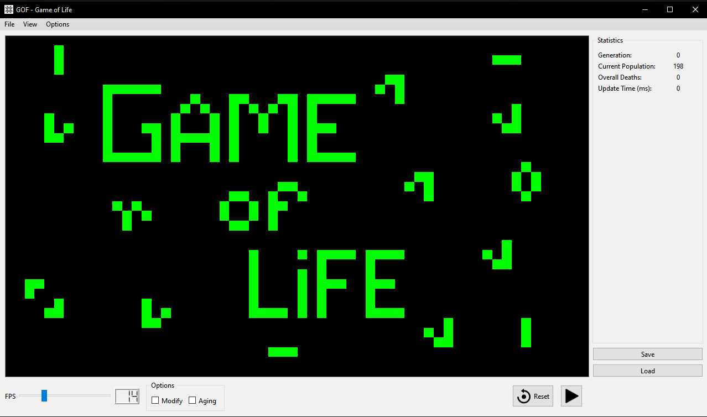
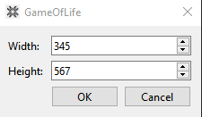

# GameOfLife
GameOfLife is a graphical user interface that gives you the control on the simulation of The Game of Life.
The Game of Life is a cellular automaton devised by the British mathematician John Horton Conway in 1970. It is a zero-player game, meaning that its evolution is determined by its initial state, requiring no further input. One interacts with the Game of Life by creating an initial configuration and observing how it evolves. It is Turing complete and can simulate a universal constructor or any other Turing machine.

## Prerequisites
Library | Version
------- | -------

[Qt C++](https://doc.qt.io/qt-5/reference-overview.html) | ^5.0.3

## Install
1. Download and launch the setup provided in this repository;
2. Follow the instructions(your OS may point to the software as malicious but, trust me, it is not);
3. Have fun!

## Run the Code
To run the code directly I suggest to use [QtCreator](https://www.qt.io/product/development-tools): download the GameOfLife directory and open it as a Qt project.

## How to Use
In this section are listed all the functionalities available in GameOfLife.

### Play/Pause and Reset
On the lower right corner there are the buttons to play/pause/resume the simulation and to reset the cell world to the initial state.

### FPS Control
On the lower left corner there is a slider with which you can control the simulation speed(FPS = frame per second).

### Modify and Aging
Directly on the right of the FPS slider there are some check boxes: check **Modify** to be able to modify the cell world with a mouse click or check **Aging** to see cells age(green=new born to red=old).

### Statistics
On the right portion of the windows there are usefull statistics about the current simulation.

### Save and Load
Through the **Save** button it's possible to save the current state of the simulation. 
If you want load a state previously saved try the **Load** button: there are also some interesting pre-set states!

### Create New Worlds
To create a new world open the top left **File** menù: you can create an empty world or a random populated one.
You can choose the size of the world through the appropiate window.

## Keyboard Shortcuts and Camera
To move around simply drag the cell world with the mouse!

Some keyboard shortcut for a better interaction.
Functionality | Combination
------- | -------
Zoom In | `+` or `Ctrl+Mouse Wheel`
Zoon Out | `-` or  `Ctrl+Mouse Wheel`
Load World | `Ctrl+O`
Save World | `Ctrl+S`
Reset | `R`
Play/Pause | `Spacebar`
